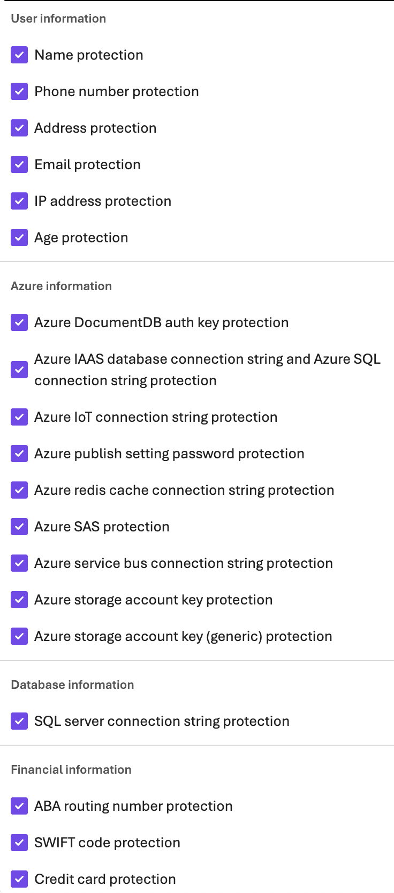

# Lab 1 - Declarative Movie Trivia Agent

This lab uses the Microsoft Agent Framework declarative path to load an agent definition from a YAML file. The agent asks movie trivia questions and grades your answers.

## What to explore

The agent definition lives in `movie-trivia-agent.yaml`. Open it and notice:

1. **Broken settings** - The temperature and token limit are intentionally set too low. Run the app, observe what happens, then fix the values in the YAML.
2. **Safety model variants** - The lab environment includes two model deployments with different RAI (Responsible AI) safety levels:
   - `gpt-4.1-min-safety` - Guardrails dialed down (least restrictive)
   - `gpt-4.1-max-safety` - Guardrails at maximum (most restrictive)

   Switch between them in the YAML to compare how each handles sensitive prompts.

## Run the lab

```bash
dotnet run
```

Or specify a different YAML file:

```bash
dotnet run -- another-agent.yaml
```

## Things to try

- Fix `temperature` (try 0.7) and `maxOutputTokens` (try 500) in the YAML
- Switch the model to `gpt-4.1-max-safety` and ask the agent about sensitive topics
- Try prompts involving profanity, PII, or harmful content to see what the guardrails block

### Profanity

Can be blocked via curated blocklist.

### SSN or similar


### Other PII



## Configuration

This lab expects its configuration from `../../appsettings.Local.json` (the shared dotnet lab config file at `labs/dotnet/appsettings.Local.json`).

Authentication uses:

- Azure OpenAI API-key auth when `AZURE_OPENAI_ENDPOINT`, `AZURE_OPENAI_API_KEY`, and a deployment name are present
- Foundry project auth when `AZURE_TENANT_ID`, `AZURE_CLIENT_ID`, and `AZURE_CLIENT_SECRET` are present
- Otherwise `DefaultAzureCredential`

## Resources

- [Microsoft Foundry Responsible AI Overview](https://learn.microsoft.com/en-us/azure/foundry/responsible-use-of-ai-overview)
- [Prompt Engineering Best Practices](https://help.openai.com/en/articles/6654000-best-practices-for-prompt-engineering-with-the-openai-api)
- [Temperature & Top-p Cheat Sheet](https://community.openai.com/t/cheat-sheet-mastering-temperature-and-top-p-in-chatgpt-api/172683)
- [OpenAI Tokenizer](https://platform.openai.com/tokenizer)
- [Microsoft Foundry Guardrails](https://learn.microsoft.com/en-us/azure/ai-foundry/guardrails/guardrails-overview?view=foundry)
