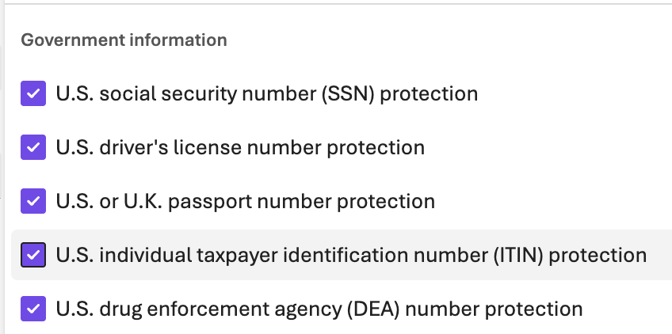

# Lab 1 - Solution

This is the completed version of the Declarative Movie Trivia Agent lab.

## What was fixed

The `movie-trivia-agent.yaml` in the `begin` folder had intentionally broken settings:

- `temperature: 0.001` - Too low, producing rigid/deterministic output
- `maxOutputTokens: 10` - Far too small, causing truncated responses

This solution sets:

- `temperature: 0.7` - Good balance of creativity and coherence for trivia
- `maxOutputTokens: 500` - Plenty of room for questions and explanations
- `model: gpt-4.1-max-safety` - Uses the stricter RAI guardrails so students can observe what gets blocked

## Safety model variants

- `gpt-4.1-min-safety` - Guardrails dialed down (least restrictive)
- `gpt-4.1-max-safety` - Guardrails at maximum (most restrictive)

Switch between them in the YAML to compare behavior with sensitive prompts (profanity, PII, harmful content).

### Profanity

Can be blocked via curated blocklist.

### SSN or similar



### Other PII


## Run

```bash
dotnet run
```

## Resources

- [Microsoft Foundry Responsible AI Overview](https://learn.microsoft.com/en-us/azure/foundry/responsible-use-of-ai-overview)
- [Prompt Engineering Best Practices](https://help.openai.com/en/articles/6654000-best-practices-for-prompt-engineering-with-the-openai-api)
- [Temperature & Top-p Cheat Sheet](https://community.openai.com/t/cheat-sheet-mastering-temperature-and-top-p-in-chatgpt-api/172683)
- [OpenAI Tokenizer](https://platform.openai.com/tokenizer)
- [Microsoft Foundry Guardrails](https://learn.microsoft.com/en-us/azure/ai-foundry/guardrails/guardrails-overview?view=foundry)
